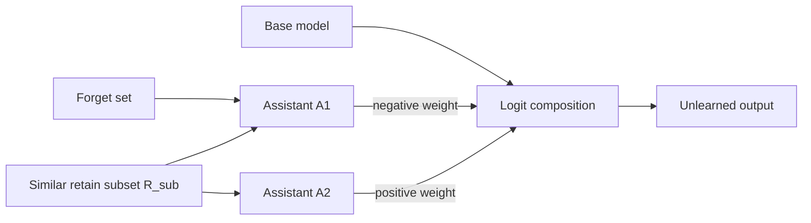

<div align="center">

# EASE

### Dual Small-Assistant Unlearning via Logit Difference

Retain-aware LLM unlearning with two compact LoRA assistants and an unchanged
base model.

[](https://github.com/JingyueCong/EASE/actions/workflows/quality.yml)


[Method](#method) · [Setup](#setup) · [TOFU](#running-tofu) · [MUSE](#running-muse) · [Configuration](#configuration-cheatsheet)

</div>

> [!NOTE]
> This is an anonymous research release for double-blind review. It includes
> the code, configs, and derived data required to reproduce experiments; model
> checkpoints and raw run artifacts are intentionally excluded.

EASE is evaluated on **TOFU** (synthetic biographical Q&A) and **MUSE**
(Books and News pre-training corpora). It uses a second assistant to protect
retain examples that are semantically close to the forget set—the region in
which a single subtractive assistant is most likely to remove useful behavior.

## Method

Given a fine-tuned base model `M_base`, EASE trains two much smaller LoRA
assistants:

- **A1** learns `forget ∪ R_sub`, where `R_sub` contains retain examples most
  similar to the forget set. A negative inference weight suppresses this
  knowledge.
- **A2** learns only `R_sub`. A positive inference weight restores the
  retain-side neighborhood affected by A1.



At inference time:

```text
final_logits = base_logits + w1 · filt(A1.logits) + w2 · filt(A2.logits)
```

where `w1 < 0` and `w2 > 0`. A1 dominates on forget items and is subtracted;
A1 and A2 approximately cancel on `R_sub`; elsewhere, their near-uniform
outputs have little effect. The relative-top filter is computed from the base
distribution and masks the same low-relevance token positions in both
assistants.

## Repository layout

```
EASE/
├── README.md                  # this file
├── ULD/                       # TOFU pipeline (built on the ULD framework)
│   ├── uld/                   # core library (model, data, training utils)
│   │   ├── model/             # Dual-ULD logit composition + relative-top filter
│   │   └── tofuutil/          # TOFU eval utilities (forget quality, model utility)
│   ├── scripts/               # entry-point Python: hf_forget_train.py, eval_tofu.py
│   ├── configs/               # Hydra configs (data, data_mode, eval, tune)
│   ├── bashes/tofu/           # end-to-end shell pipelines
│   │   └── dual_uld_pipeline.sh   # ★ canonical TOFU run
│   └── data/                  # data augmentation + retain reference results
│       ├── aug_data/tofu/     # paraphrased + perturbed answers (provided)
│       └── retain*_*_wd0.01/  # retain-only reference for forget_quality KS test
│
├── dual_uld_muse/             # MUSE training code
│   ├── build_rsub.py          # select R_sub via embedding similarity
│   ├── paraphrase_forget.py   # generate paraphrases via DeepSeek API
│   ├── perturb_forget.py      # generate perturbations via DeepSeek API
│   ├── train_assistant.py     # train one assistant (A1 or A2) on Books/News
│   ├── run_dual_uld_muse.sh   # ★ canonical MUSE pipeline (train A1+A2 + sweep)
│   ├── sweep_eval.sh          # eval-only sweep over a w1 grid (w2 = |w1|)
│   ├── aug/                   # paraphrase + perturbation jsonl (provided)
│   └── rsub/                  # precomputed R_sub indices (provided)
│
├── open-unlearning/           # MUSE evaluation framework (upstream + our patches)
│   ├── src/model/dual_uld.py  # ★ our DualULD HuggingFace wrapper
│   ├── src/model/uld.py       # single-assistant ULD baseline
│   ├── src/evals/muse.py      # MUSE benchmark eval
│   └── ...                    # rest is upstream open-unlearning
│
└── scripts/
    └── run_dual_uld_1b.sh     # ★ Llama-3.2 1B TOFU run via open-unlearning
                               #   (override env vars to target 3B —
                               #    see "Llama-3.2 ... via open-unlearning" below)
```

## Prerequisites

- Linux with Python 3.10 or newer. The pinned ULD environment uses Python
  3.10; the bundled open-unlearning package supports Python 3.10+.
- One or more CUDA-capable GPUs (TOFU 1B fits on a single 24GB; TOFU 7B / 3B
  needs 40GB+; MUSE LLaMA-2-7B needs 40GB+)
- HuggingFace token only if you fetch gated models (LLaMA-2). Set with
  `export HF_TOKEN=...` or `huggingface-cli login`.
- DeepSeek API key (or any OpenAI-compatible endpoint) **only** if you want
  to regenerate the MUSE paraphrase / perturbation augmentations. The
  precomputed augmentations are already shipped in `dual_uld_muse/aug/` and
  `ULD/data/aug_data/tofu/`, so a normal run does **not** need the API.

The entry-point scripts infer the repository root automatically. Setting
`EASE_ROOT` explicitly remains useful for interactive commands:

```bash
export EASE_ROOT=$(pwd)
```

Trained LoRA checkpoints are not shipped — the training scripts will write
them to `outputs_trained_models/` (created on first run). Override the
location via `MODELS_ROOT=...` if you need to.

## Setup

Clone the repository and choose the environment for the benchmark you want to
run:

```bash
git clone https://github.com/JingyueCong/EASE.git
cd EASE
export EASE_ROOT="$(pwd)"
```

### TOFU (`ULD/`)

```bash
cd $EASE_ROOT/ULD
conda env create -f environment.yaml      # creates env "uldenv"
conda activate uldenv
pip install -e .
```

### MUSE training (`dual_uld_muse/`)

Reuses the same conda env as ULD. Additional pip packages:
```bash
pip install sentence-transformers openai
```

### Evaluation with `open-unlearning/`

```bash
cd $EASE_ROOT/open-unlearning
pip install -r requirements.txt
pip install -e .
python setup_data.py    # downloads MUSE benchmark data into HF cache
```

If training and evaluation use separate environments, pass their Python
interpreters to the orchestration scripts. For TOFU, use `ULD_PY` and `OU_PY`;
for MUSE, use `TRAIN_PY` and `EVAL_PY`.

## Running TOFU

The end-to-end pipeline (R_sub selection → train A1 → train A2 → evaluate):

```bash
cd $EASE_ROOT/ULD
GPUS=0 SPLIT=forget10 K=80 \
    bash bashes/tofu/dual_uld_pipeline.sh
```

Knobs:
- `SPLIT` ∈ `{forget01, forget05, forget10}` — TOFU forget percentage.
- `K` — `|R_sub|` (we used 80 for forget10, scale ~ proportional to forget size).
- `GPUS` — comma-separated CUDA device ids. Multi-GPU triggers DDP.

Output:
- LoRA checkpoints under `outputs_trained_models/tofu_dual/...`
- Eval logs (with `forget_quality`, `forget_proba`, ROUGE-L on
  forget/retain/real_authors/world_facts) under
  `outputs/tune_log/.../eval_tofu.log`.

### Llama-3.2 1B / 3B (via the open-unlearning framework)

A single script ships at [scripts/run_dual_uld_1b.sh](scripts/run_dual_uld_1b.sh).
It trains both assistants for all three forget splits and evaluates with
open-unlearning's TOFU metrics.

Default settings target **Llama-3.2-1B-Instruct**:

```bash
GPU=0 bash scripts/run_dual_uld_1b.sh
```

To run on the **3B base model**, override the shell
variables — no script edit needed. The relevant knobs are env-var driven:

| env var | 1B (default) | 3B |
|---|---|---|
| `HF_BASE_PREFIX` | `open-unlearning/tofu_Llama-3.2-1B-Instruct` | `open-unlearning/tofu_Llama-3.2-3B-Instruct` |
| `HF_TOKENIZER`   | `${HF_BASE_PREFIX}_full` | same |
| `OU_MODEL` | `Llama-3.2-1B-Instruct_DualULD` | `Llama-3.2-3B-Instruct_DualULD` |
| `RUN_NAME` | `Llama-3.2-1B-Instruct` | `Llama-3.2-3B-Instruct` |
| `RUN_SLUG` | `llama3_1b` | `llama3_3b` |
| `ULD_MODEL` | `llama-3-1b` | `llama-3-3b` |
| `NUM_LAYER` (assistant depth) | `2` | `7` |
| `LORA_R` | `16` | `16` |
| `WEIGHT_A1` / `WEIGHT_A2` | `-1.0` / `1.0` | `-0.8` / `0.5` |
| `TOP_FILTER` | `0.01` | `0.01` |
| `TRAIN_BS` / `TRAIN_GA` | `4 / 4` | `2 / 8` |
| `TRAIN_EP_A1` / `TRAIN_EP_A2` | `10 / 10` | `5 / 3` |

Example — 3B run on GPU 1:

```bash
GPU=1 \
HF_BASE_PREFIX=open-unlearning/tofu_Llama-3.2-3B-Instruct \
HF_TOKENIZER=open-unlearning/tofu_Llama-3.2-3B-Instruct_full \
OU_MODEL=Llama-3.2-3B-Instruct_DualULD \
RUN_NAME=Llama-3.2-3B-Instruct \
RUN_SLUG=llama3_3b ULD_MODEL=llama-3-3b \
NUM_LAYER=7 WEIGHT_A2=0.5 \
TRAIN_BS=2 TRAIN_GA=8 TRAIN_EP_A1=5 TRAIN_EP_A2=3 \
bash scripts/run_dual_uld_1b.sh
```

To run a single split only (skip the others), set `ONLY=forget10` (or
`forget01` / `forget05`).

For LLaMA-2-7B on the original ULD framework, use the canonical TOFU
pipeline shown above (`bashes/tofu/dual_uld_pipeline.sh`).

### Reproducing best TOFU numbers (LLaMA-2-7B)

| Split | Forget Quality | Model Utility | `w1 / w2 / top_p / num_layer` |
|---|---|---|---|
| forget05 | 0.713 | 0.847 | −0.8 / 0.8 / 0.01 / 8 |
| forget10 | 0.654 | 0.874 | −0.8 / 0.8 / 0.01 / 8 |

These weights are set by `model_mode.dual_uld` in
`ULD/configs/model_mode/dual_uld.yaml`. `forget_quality` is the KS-test
p-value vs. a retain-only reference shipped under `ULD/data/retain*_llama_wd0.01/`.

## Running MUSE

Step 1 — build `R_sub` (chunks of `retain1` most similar to forget chunks):

```bash
cd $EASE_ROOT/dual_uld_muse
python build_rsub.py --split Books --k_frac 0.25
python build_rsub.py --split News  --k_frac 0.20
```

(Outputs `rsub/{Books,News}_rsub.json`. Already shipped.)

Step 2 — (optional) regenerate paraphrase / perturbation augmentations:

```bash
DEEPSEEK_API_KEY=... python paraphrase_forget.py --split Books --n_paraphrase 2
DEEPSEEK_API_KEY=... python perturb_forget.py    --split Books --n_perturb 2
# repeat with --split News
```

Outputs land in `aug/{Books,News}_{paraphrases,perturbations}.jsonl`.
(Already shipped — skip this step to use ours.)

Step 3 — train A1 + A2 and sweep eval weights with one command:

```bash
cd $EASE_ROOT/dual_uld_muse
bash run_dual_uld_muse.sh                 # default: Books
SPLIT=News bash run_dual_uld_muse.sh      # News
```

The script trains both assistants and then runs the eval over a default
`w1` grid, printing `forget_ROUGE / privleak / retain_ROUGE` per weight.
Results land in
`$EASE_ROOT/open-unlearning/saves/eval/muse_Llama-2-7b-hf_<SPLIT>_DualULD_w*/MUSE_SUMMARY.json`.

To use **different hyperparameters**, override env vars (no script edit):

| env var | Books default | News default | meaning |
|---|---|---|---|
| `NUM_LAYER` | `8`    | `16`   | assistant transformer depth |
| `LORA_R`    | `16`   | `64`   | LoRA rank (`LORA_ALPHA` defaults to `2*LORA_R`) |
| `LR`        | `1e-3` | `5e-4` | learning rate |
| `EPOCHS_A1` | `5`    | `10`   | A1 epochs |
| `EPOCHS_A2` | `3`    | `5`    | A2 epochs |
| `BATCH_SIZE` / `GRAD_ACCUM` | `1` / `4` | `1` / `4` | per-step batch & accumulation |
| `WS`        | `"-0.3 -0.5 -0.7 -0.9 -1.1"` | same | space-separated `w1` grid (sweep_eval.sh sets `w2 = |w1|`) |
| `GPU`       | `0`    | `0`    | CUDA device |

Manual eval (skip training, sweep arbitrary weights on existing
checkpoints):

```bash
GPU=0 bash sweep_eval.sh Books "-0.3 -0.5 -0.6 -0.8"
```

By default `sweep_eval.sh` runs the **fast** eval profile (skips verbmem +
extraction). For the **full** MUSE eval, pass `EXP=eval/muse/default`.

## Configuration cheatsheet

The DualULD logit composition is implemented in two places that share the
same shape:

- TOFU: `ULD/uld/model/dualcontrastllm.py` (single-ULD baseline is `contrastllm.py` in the same directory; selected via `ULD/configs/model_mode/dual_uld.yaml`)
- MUSE: `open-unlearning/src/model/dual_uld.py` (HuggingFace
  `AutoModelForCausalLM` subclass for the open-unlearning harness)

Key knobs (both frameworks):

| name | meaning | typical |
|---|---|---|
| `weight_a1` | scales A1 logits (negative — subtracts) | −0.6 to −1.0 |
| `weight_a2` | scales A2 logits (positive — restores R_sub) | `\|w1\|` |
| `top_logit_filter` | mask assistant tokens outside the base model's relative-top set | 0.01 |
| `num_layer` | # of base-model layers used for the LoRA assistants | 4 or 8 |

## What is *not* shipped

To keep the repository lightweight and preserve the anonymous-review release:

- No trained model weights (LoRA adapters, full-FT checkpoints). Re-run the
  training scripts above.
- No raw experiment outputs (`outputs/`, `outputs_trained_models/`,
  `saves/eval/` are excluded).
- No nested upstream `.git/` directories.

The data augmentation files (paraphrases, perturbations, R_sub indices) and
the retain-only reference results (used by TOFU's `forget_quality` KS test)
**are** included so eval is reproducible end-to-end without external API
calls.

## Acknowledgements

This codebase builds on top of two public projects whose licenses and
upstream code are preserved:

- **ULD** — single-assistant logit-difference unlearning. We extend it with
  a second assistant (A2) and the R_sub mechanism. Original framework is
  contained in `ULD/`.
- **open-unlearning** — unlearning evaluation harness. We add
  `src/model/dual_uld.py` and adapter configs. The rest of `open-unlearning/`
  is upstream.

We do not claim authorship of the upstream files. See `ULD/LICENSE` and
`open-unlearning/LICENSE`.
